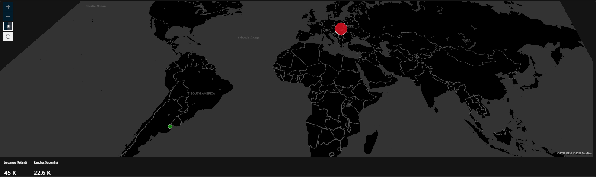

# Azure Sentinel (SIEM) & Real-Time Honeypot Lab

## Introduction
This project demonstrates the setup of a cloud-native **SIEM (Microsoft Sentinel)** connected to a live Windows 10 Virtual Machine acting as a **Honeypot**. The objective was to expose a vulnerable system to the public internet, capture RDP brute-force attacks, and use **KQL (Kusto Query Language)** to enrich the logs with geographic location data for real-time visualization.

---

## Architecture & Data Flow
1. **Honeypot Deployment:** A Windows 10 VM was deployed with its Network Security Group (NSG) and Windows Firewall disabled to attract all inbound traffic.
2. **Log Ingestion:** Security events (Event ID 4625 - Failed Logon) were forwarded to a **Log Analytics Workspace** using the **Azure Monitor Agent (AMA)** and a **Data Collection Rule (DCR)**.
3. **Data Enrichment:** A custom **Watchlist** (`geoip-summarized.csv`) containing ~54,000 rows of geographic IP data was imported into Sentinel.
4. **Analysis & Visualization:** Custom KQL queries were used to map IP addresses to physical locations, visualizing the results in a **Sentinel Workbook**.

---

## Technologies & Platforms Used
* **Cloud Infrastructure:** Microsoft Azure (Virtual Machines, Network Security Groups)
* **SIEM:** Microsoft Sentinel
* **Log Management:** Log Analytics Workspaces (LAW)
* **Log Forwarding:** Azure Monitor Agent (AMA) & Data Collection Rules (DCR)
* **Query Language:** KQL (Kusto Query Language)
* **Data Enrichment:** Sentinel Watchlists (GeoIP database)
* **Visualization:** Azure Sentinel Workbooks (JSON-based maps)

---

## Project Implementation

### 1. Honeypot Setup & Insecurity Configuration
* Created a Windows 10 Virtual Machine in Azure and configured the NSG to allow **all traffic inbound** (Any/Any rule).
* Logged into the VM and disabled the Windows Firewall for all profiles (Domain, Private, and Public) to ensure the system was fully reachable by external scanners.

### 2. SIEM Configuration & Log Ingestion
* Deployed a **Log Analytics Workspace** and a **Microsoft Sentinel** instance.
* Configured the **Windows Security Events via AMA** connector to stream logs from the Honeypot to the LAW.
* Verified log flow by manually failing login attempts on the VM and querying the `SecurityEvent` table for **Event ID 4625**.

### 3. Log Enrichment via Sentinel Watchlist
To identify the geographical origin of attacks, I imported a GeoIP database as a **Sentinel Watchlist** named `geoip`. This allowed me to correlate raw IP addresses with physical countries and coordinates directly in the SIEM.

**KQL Enrichment Query:**
```kusto
let GeoIPDB_FULL = _GetWatchlist("geoip");
let WindowsEvents = SecurityEvent
    | where EventID == 4625
    | evaluate ipv4_lookup(GeoIPDB_FULL, IpAddress, network);
WindowsEvents
```
[](World_Attack_Map.png)
*Figure 1: Real-time map visualizing global RDP brute-force attempts.*
## Security Analysis & Findings

During the monitoring period, the honeypot was subjected to massive automated brute-force campaigns:

* **Massive Attack Volumes:** A single source in **Jordanów, Poland** accounted for over **45,000** failed login attempts.
* **Global Reach:** Significant activity was also recorded from **Ranchos, Argentina**, with over **22,600** attempts.
* **Rapid Discovery:** The VM was discovered by automated botnets within minutes of the **Network Security Group (NSG)** being opened to the internet.

---

## Key Takeaways
* **Threat Landscapes:** Gained a firsthand look at how quickly exposed assets are discovered by automated botnets. Within minutes of deployment, attacks were logged from multiple countries.
* **Log Lifecycle:** Mastered the flow of data from local event generation to cloud-based analysis and visualization.
* **SIEM Proficiency:** Developed practical skills in configuring Sentinel, managing Log Analytics Workspaces, and writing complex KQL queries to handle custom logs.
